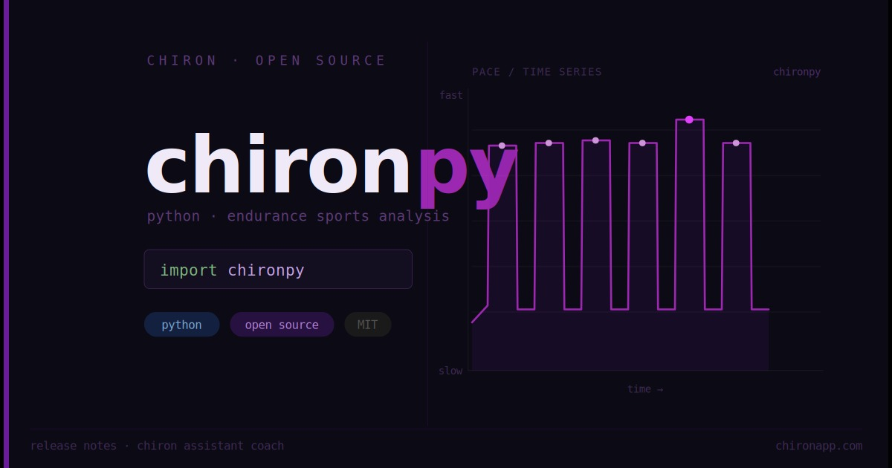

# chironpy

**Endurance sports analysis library for Python**

**chironpy** is a Python library for analysing endurance sports data. Load workouts from `.fit`, `.gpx`, `.tcx`, or the Strava API and analyse them with a familiar pandas-based interface — compute best intervals, elevation gain, speed, power, and more.

## Installation

```bash
# with uv (recommended)
uv add chironpy

# with pip
pip install chironpy
```

## The `WorkoutData` Class

At the core of chironpy is the `WorkoutData` class. It provides a standardised structure for representing workouts and includes built-in methods for computing metrics, smoothing data, and extracting performance intervals.

### Key Features

- Standardised data structure from multiple supported file formats (`.fit`, `.gpx`, `.tcx`) and the Strava API
- Wraps `pandas.DataFrame` — use any pandas method directly
- Standardised columns: `speed`, `power`, `heartrate`, `cadence`, `elevation`, `distance`, `latitude`, `longitude`. See [nomenclature](features/nomenclature.md)
- Resamples activity data at 1 Hz by default for clean time-series analysis
- Built-in metric computations: best time and distance intervals, elevation gain, grade

### Example

```python
from chironpy import WorkoutData

# Load workout from file
data = WorkoutData.from_file("path/to/file.fit")

# Elevation gain
gain = data.elevation_gain()

# Best time-based intervals
durations = [30, 60, 120, 300, 600, 1200, 1800, 3600]  # seconds
max_hr = data.best_intervals(durations, "heartrate")

# Best distance-based intervals
distances = [1000, 5000, 10000, 21100]  # metres
fastest = data.fastest_distance_intervals(distances)

# Resample to 10-second buckets
data.resample_records("10s")
```

More information about running metrics can be found [here](features/running_metrics.md).

The data structure returned by `WorkoutData` is standardised across file types. Read more [here](features/nomenclature.md).

## Contributing

See [contributing](contributing.md).

## Contributors

- [Clive Gross](https://github.com/clivegross)
- [Chiron - The endurance training platform](https://github.com/chironapp)

## Attribution

chironpy is a maintained fork of [sweatpy](https://github.com/GoldenCheetah/sweatpy) by [Maksym Sladkov](https://github.com/sladkovm) and [Aart Goossens](https://github.com/AartGoossens).

With thanks to [Aaron Schroeder](https://github.com/aaron-schroeder) for work on running power and elevation metrics in [heartandsole](https://github.com/aaron-schroeder/heartandsole) and [spatialfriend](https://github.com/aaron-schroeder/spatialfriend).

## Changelog

See [CHANGELOG.md](changelog.md) for a full list of changes and version history.

## License

See [LICENSE](LICENSE) file.
